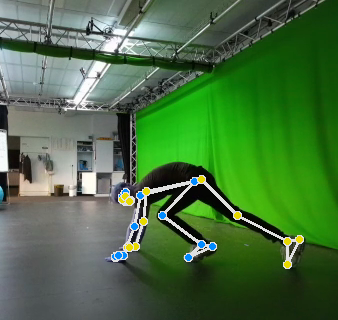
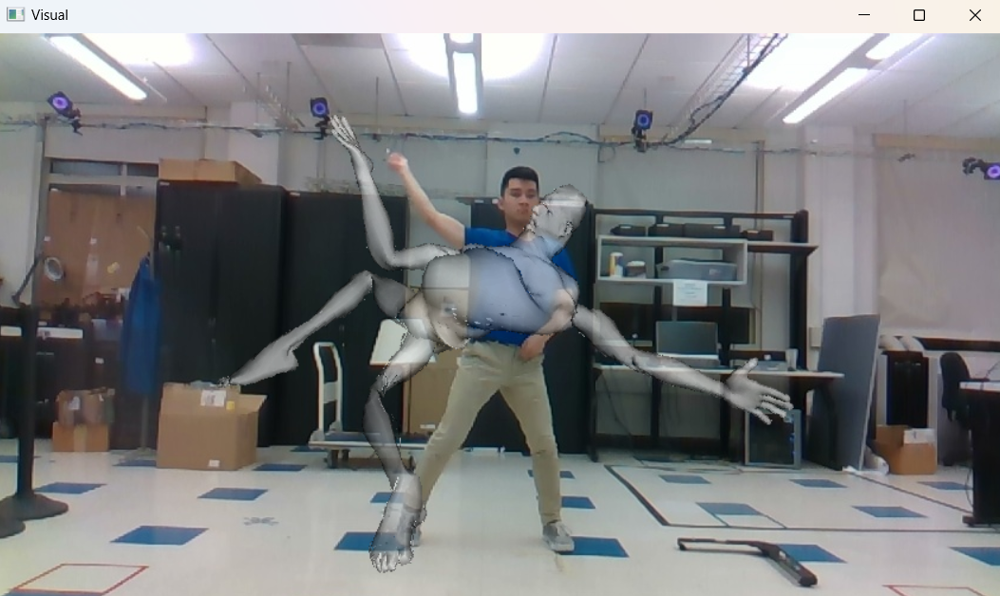

# Evaluation of Real-Time SMPL Model Representation and Integration

### Luke Mikat, Abraham Neme Alvarez, Valdone Zabutkaite

## Poster

TODO

## Problem Description

In marker-based motion capturing (MoCap), markers are placed on the body. However, it is not always possible to place all markers exactly where they ideally belong. As a result, the relationship between the markers and the skeleton is missing, which means that the skeletal structure can no longer be accurately reconstructed from the markers.

## Proposed Solution

To improve the relationship between MoCap markers and the skeleton, it is proposed to test existing research that utilizes parametric human models such as [SMPL (Skinned Multi-Person Linear Model)](https://smpl.is.tue.mpg.de/). These models can be embedded in depth images captured by RGBD cameras, such as the Azure Kinect.

The main idea is to first fit the SMPL model to the depth images and then recognize the MoCap markers to establish their relationship with the SMPL model. By using the SMPL model, more accurate marker positioning could be achieved, because the model provides detailed information about the human body shape and structure.

To ensure the quality and functionality of the existing approach for fitting the SMPL model onto a human in real time, a comprehensive evaluation will be conducted. The created setup will evaluate on the method's ability to accurately and consistently represent a person as an SMPL model in real-time and fit it to the depth images. This includes evaluating the accuracy of the model fitting, particularly regarding the alignment and coverage between the estimated body parameters and the real recordings. Potential sources of error will also be identified and analyzed to ensure that the approach is robust against different body shapes, movements, camera perspectives and lighting conditions. The results of this evaluation will serve as the basis for making improvements and optimizing the method for use with the markers.

## Approach

1. **Review of Existing Methods:**
- Review current solutions based on the SMPL model, such as the [Avatar Project](https://github.com/sxyu/avatar). This repository written in C++ enables the mapping of 3D-SMPL models onto human bodies in real time. It will be evaluated for its suitability for the task.
   
2. **Avatar Project Setup:**
- The Avatar Project will be configured to work in real time with depth images from the Azure Kinect. The goal is to integrate the SMPL model into the captured depth data and create an accurate representation of the person shown in the recordings.

3. **Utilizing and Testing the SMPL Demo and Live-Demo:**
- In the provided repository there are 2 executables, which can be used for creating the real time human representation as the SMPL model. The demo, which is utilizing a prerecorded dataset for displaying the SMPL model frame by frame, and the live demo, which is displaying the SMPL model in the Kinect cameras live stream. Both these will be used to test the functionality of the SMPL model. Suitable datasets must also be created or collected to serve as the basis for the evaluation.

4. **Evaluation of the SMPL-Model Fitting:**
- A comprehensive evaluation of the performance of the SMPL model representation will be conducted to assess the quality of fitting the model to depth recordings of a human. Particular attention will be given to the accuracy of the pose estimation and body shape representation of the model. Weaknesses in the fitting process will be documented to identify potential improvements.

5. **(Optional): Marker Detection and Assignment**
- The markers positions will be mapped to the SMPL model to allow for more precise determination of their location relative to the body structure. This aims to improve the accuracy and functionality of the entire tracking system.

## Avatar Project

### Overview


### Dependencies

The following configuration of the repository requires you to have Windows or Linux as your OS, as the Azure Kinect SDK is not available for macOS. The setup has only been thoroughly tested on Windows.

First you will need to install [cmake](https://cmake.org/download/) to build the project.

We have used vcpkg to manage the projects dependencies. With the following commands you can install it:

```bash
git clone https://github.com/microsoft/vcpkg.git
cd vcpkg
./bootstrap-vcpkg.bat # For Windows
./bootstrap-vcpkg.sh  # For Linux
./vcpkg integrate install
```

Make sure you are inside your vcpkg directory. Install the projects dependencies via vcpkg:

```bash
./vcpkg install azure-kinect-sensor-sdk
./vcpkg install opencv3
./vcpkg install opencv3[openexr]
./vcpkg install eigen3
./vcpkg install zlib
./vcpkg install boost
./vcpkg install ceres
./vcpkg install glfw3
```

### Test Data

The model data and OpenARK datasets from the [original repository](https://github.com/sxyu/avatar/releases/) were no longer available, so [this guide](https://github.com/augcog/OpenARK/tree/master/data/avatar-model) had to be followed to obtain and create the necessary files for testing.

#### Model

The `data/avatar-model` directory has to include the following files for running the `live-demo.exe` and `demo.exe`:

- model.pcd
- skeleton.txt
- joint_regressor.txt
- pose_prior.txt
- tree.150k.refine.srtr
- tree.150k.refine.srtr.partmap

#### OpenARK Datasets

The `demo.exe` is utilizing datasets in form of the OpenARK datasets.

Download and extract the [OpenARK-Dataset](https://github.com/sxyu/OpenARK-Deps/releases/download/0.0.1/avatar-dataset.zip) to the directory `data/avatar-dataset`.


### Build

Make sure you are inside the root directory of your project. Replace the path to vcpkg in the following command:

```bash
cmake -B build -S . -DCMAKE_TOOLCHAIN_FILE=C:\path\to\vcpkg\scripts\buildsystems\vcpkg.cmake
```

```bash
cd build
cmake --build build --config Release
cd Release
```

Make sure the files `live-demo.exe` and `demo.exe` have been created.

### Live-Demo 

The live demo displays a real-time representation from an Azure Kinect camera, visualizing a SMPL model onto the person in the image.

Execute this command inside the `Release` directory to start the live demo:

```bash
./live-demo.exe --rtree ./tree.150k.refine.srtr
```

#### Controls

- `Q` or `ESC`: Quit the demo.
- `b`: Set background
- `0-3`: Toggle between background options:
  - `0`: Empty background.
  - `1`: RGB background.
  - `2`: Depth background.
  - `3`: Custom background.
- `h`: Show or hide the human bounding box.
- `t`: Toggle between Random Tree visualization and SMPL model visualization.
- `SPACE`: Start or pause the demo.

#### Options

- `--rtree arg`: Path to the RTree model. (Required)
- `-R [ --rtree-only ]`: Show only the RTree part segmentation and skip optimization.
- `--no-occlusion`: Disable occlusion detection in avatar optimizer prior to neural network (NN) matching.
- `--betapose arg (default: 0.05)`: Pose prior term weight for optimization loss function.
- `--betashape arg (default: 0.12)`: Shape prior term weight for optimization loss function.
- `--nnstep arg (default: 20)`: Number of nearest-neighbor points to match per step (speed heuristic, currently not used).
- `-t [ --frame-icp-iters ] arg (default: 3)`: ICP iterations per frame.
- `-T [ --reinit-icp-iters ] arg (default: 5)`: ICP iterations when reinitializing after tracking loss.
- `-e [ --initial-icp-iters ] arg (default: 7)`: ICP iterations during initial reinitialization.
- `-I [ --data-interval ] arg (default: 12)`: Interval for computing RTree weights and optimizing pixels.
- `-p [ --inner-iters ] arg (default: 10)`: Maximum inner iterations per ICP step.
- `-i [ --intrin-path ] arg`: Path to the camera intrinsics file (default: hardcoded K4A intrinsics).
- `-b [ --bg-path ] arg`: Path to the background image.
- `--initial-per-part-thresh arg (default: 80)`: Minimum detected points per body part to start tracking.
- `-M [ --min-points ] arg (default: 1000)`: Minimum detected body points required to continue tracking. If it falls below this number, the tracker reinitializes.
- `-N [ --nn-dist ] arg (default: 0.002)`: Minimum distance (scales with image size) between background pixel and current pixel.
- `-n [ --neighb-dist ] arg (default: 0.001)`: Minimum distance (scales with image size) between neighboring pixels for background subtraction.
- `--dist-to-pre-weight arg (default: 0.001)`: Weight of squared distance to the previous center of mass for selecting the best-connected component in RTree postprocessing.
- `--width arg (default: 1280)`: Width of the generated images.
- `--height arg (default: 720)`: Height of the generated images.
- `--k4a`: Force Kinect Azure (K4A) depth camera usage.

### Demo

The demo showcases the processing and animation of the SMPL model (`data/avatar-model`) based on a pre-recorded OpenARK dataset (`data/avatar-dataset`), which includes RGB images, depth images and the joints. This demo is designed to illustrate the results of the application without requiring real-time data from the Azure Kinect.

```bash
cd build/Release
./demo --rtree tree.150k.refine.srtr --dataset_path ../../data/avatar-dataset/human-dance-random --image 351 --background 351
```

#### Options
  - `--dataset_path`: Root directory containing the input dataset. (Required)
  - `--rtree`: Path to the RTree model used for segmentation. (Required)
  - `--background` (`-b`): Background image ID (default: 9999). (Required)
  - `--image` (`-i`): Current image ID (default: 1). (Required)
  - `--pad` (`-p`): Padding width for image names (default: 4).
  - `--rtree-only` (`-R`): Flag to skip optimization and only show RTree segmentation.
  - `--no-occlusion`: Disable occlusion detection in the avatar optimizer.
  - `--betapose`: Weight for the pose prior term in optimization (default: 0.05).
  - `--betashape`: Weight for the shape prior term in optimization (default: 0.12).
  - `--data-interval`: Pixel computation interval. Lower values increase RTree segmentation accuracy but increase computational load. (default: 12). 
  - `--nnstep`: Step size for nearest-neighbor search during optimization (default: 20). Reducing it improves accuracy but may slow processing.
  - `--frame-icp-iters` (`-t`): ICP iterations per frame (default: 3). Higher values improve accuracy but slow down the process.
  - `--reinit-icp-iters` (`-T`): ICP iterations during reinitialization (default: 6). Higher values improve accuracy but slow down the process.
  - `--inner-iters`: Maximum inner iterations per ICP step (default: 10).
  - `--min-points` (`-M`): Minimum number of detected body points required for tracking (default: 1000). Lower values increase the risk of tracking failure due to insufficient points.

#### Data Recording

This executable can be used for recording necessary parts of an OpenARK dataset. However, due to missing generation of critical files, such as joint data, the datasets created with this tool could not be used for the demo.

### Evaluation

#### Approach

1. **Comparing body shapes:** The purpose of this python script is to evaluate the similarity between two images containing human forms, specifically by comparing the non-black regions of the images. The images were obtained by dividing a video of the Live-Demo into frames and they show different models of a human body obtained from the same frame one being a depth-image and the other one the generated SMPL-model. The objective is to determine the accuracy of Avatar project by determining how similar they are in terms of the body shape they contain, discarding the black areas in the background.

2. **Comparing human poses:** In this evaluation, we assess the performance of the SMPL model in replicating human poses based on pose landmarks. For comparison, we used MediaPipe Pose landmarks to extract 2D keypoints from both RGB images, since MediaPipe is trained on RGB images, and computed the Euclidean distance between corresponding landmarks. This metric provides an indication of how well the SMPL model matches the actual poses.

#### Metrics

1. **Comparing body shapes:** The main metrics of the test are as follows.

   - Similarity Percentage: Indicates the proportion of non-black pixels (value 1) that match between the two images, measuring the similarity between the shapes present, excluding the black background.

   - Total Relevant Pixels: Counts pixels where at least one of the images has a value of 1, evaluating only significant areas containing shapes.

   - Number of Coincidences: Represents the number of pixels where both images have a value of 1, key to calculate the percentage of similarity.

   - Number of Non-Matching Pixels: Reflects the pixels where one image has a value of 1 and the other does not, pointing out the differences between the two shapes.

   The percentage of accuracy is then determined by this formula:
   
   Accuracy = Number of matching pixels (1's in both images) / Total number of relevant pixels (where at least one image has 1) * 100

2. **Comparing human poses:**

   - Pose Landmarks in the RGB image: x,y coordinates for the joints (e.g. elbow, knee, wrist, etc.) of the human body in the image, 33 pose landmarks

   - Pose Landmarks in the 3D model image

   - Euclidean distance between the pose landmarks: positional difference between corresponding joints 
            
   - Mean Euclidean distance across all landmarks: average positional difference between corresponding joints

   - Mean Euclidean distance across all landmarks and images: average positional difference between corresponding joints over the entire dataset

#### Implementation

1. **Comparing body shapes:** The script begins by loading two images (depth-image and SMPL-image). The images are initially preprocessed to facilitate the conversion to binary. This preprocessing includes creating and applying some color masks to the depth image to isolate the body shape and a grayscale conversion for both images, which reduces the number of color channels to one, facilitating the identification of black and non-black pixels. Once converted to grayscale, each image is analyzed pixel by pixel. The grayscale pixel values are compared to a threshold to determine whether they are black (value close to 0) or non-black (value other than 0). Based on this, a binary array is generated: If the pixel is black, a value of 0 is assigned. If the pixel is non-black, a value of 1 is assigned.
This process generates two binary arrays, one for each image, where each value indicates whether the corresponding position in the image contains relevant information (human form) or black background. The comparison of the images is performed at the level of the binary arrays, only positions where at least one of the images has a value of 1, i.e. where there are non-black pixels, are considered. Within the relevant indices, cases where both images have a value of 1 are counted, indicating that both represent a shape at that position. Positions where both images have a 0 (black background) are discarded from the calculation, as they do not provide information about the shape. The similarity between the two images is calculated as the percentage of coincidences in the relevant pixels.

2. **Comparing human poses:** After applying the MediaPipe Pose landmark model on the dataset, it was observed that pose landmarks were often not detected when the subject was positioned far from the camera. To enhance detection accuracy, all images were cropped to bring the subject closer and more visible to the model. The process begins by creating a MediaPipe Pose model object. Both the RGB image and the 3D model image are loaded, converted to RGB format, and transformed into MediaPipe image objects. These images are then passed to the model, which outputs the pose landmarks in normalized coordinates (x, y, z). To facilitate pose analysis, MediaPipe's API for drawing and connecting landmarks on the images was utilized, and the images with drawn landmarks were saved for visualization purposes. The next step involves comparing the pose landmarks from the RGB image with those of the 3D model images. The Euclidean distance between corresponding landmarks is calculated for each frame. In cases where the MediaPipe model failed to detect landmarks, a Euclidean distance of 1 was assigned to those images. For each image, the mean Euclidean distance across all pose landmarks was calculated and saved in the JSON file along with the frame name.
After analyzing all images, the mean Euclidean distance for all images was calculated. Images with distances marked as 1 (due to no detection) were excluded from the evaluation. Additionally, images with large distances were reviewed, revealing incorrect landmark placements in some cases. These images were also removed from the final analysis to ensure accurate and reliable results.

#### Results

1. **Comparing body shapes:** Through this test it was possible to demonstrate that the avatar project can achieve 80% or better accuracy in detecting and reproducing most simple postures, such as standing, stretching the arms out to the sides and upward, and walking in a straight line. However, it has difficulty detecting more complicated poses such as jumping, crouching or lying down, averaging between 50-60% accuracy. It shows even lower results of around 30% when it comes to poses that do not allow the program to observe and detect part of the person's body standing before the camera. In the end a total of 280 frames from the Live-Demo with a variety of poses were analysed and the average accuracy obtained was of 65.35%.

   - Extraction of human shape from depth images
     


   - Frame with 82.78% accuracy
     


   - Frame with 38.20% accuracy
     


2. **Comparing human poses:**

The mean Euclidean distance across all images was 0.043, indicating that, on average, the SMPL model keypoints differed by 4.3% of the image dimensions compared to the real human pose.


   - Strong Performance: The SMPL model performed well in most cases, with 316 out of 406 images (77.8%) showing a mean Euclidean distance of less than 0.05. This indicates that the SMPL model is able to capture and replicate human poses with reasonable accuracy in the majority of frames.

   - Outliers: The presence of some images with distances greater than 0.05 (90 images) suggests that in some instances, the model deviated more significantly from the true pose. The largest distance of 0.23 highlights occasional instances of substantial misalignment between the model and the real pose

   The smallest mean Euclidean distance observed was 0.01, reflecting very close alignment between the SMPL model and the actual pose in that image.

   

   

   The largest mean Euclidean distance recorded was 0.23, suggesting a more significant deviation between the SMPL model and the real pose in this case.

   

   

The evaluation shows that the SMPL model generally performs well in replicating simple human poses, with a mean Euclidean distance of 0.043 across all images, indicating a deviation of only about 4.3% of the image dimensions on average. However, as the complexity of the pose increased, such as with jumping or crouching, the error became more pronounced, reflecting the model's difficulty in capturing more intricate movements. Overall, the results indicate that the SMPL model is a reliable tool for pose replication, but with room for refinement in certain cases.


#### Live-Demo
     
 

#### Demo

The Demo program was able to work with the OpenARK dataset, however after intensive testing and adjustment of the multiple parameters we were not able to get positive and relevant results. Even with simple poses, that are handled effortlesly by the Live-Demo, the Demo program struggled to identify the human in the image and match the SMPL-model with it. Results from the Demo are shown below.




### Project Retrospective

Reproducing the repository proved to be a challenging task due to outdated C++ libraries and dependency conflicts. Additionally, both the datasets and models were missing, and the links provided in the repository were no longer available. As a result, we had to assemble the datasets ourselves, which was time-consuming and prone to errors, due to the lack of documentation. We managed to get both the live demo and the demo to work and could evaluate them. Due to the sheer lack of documentation and necessary files from the model and OpenARK datasets we had to put more time into understanding the repositories workflows instead of concentrating on the evaluation itself. 

### Future Research

The optional marker detection and assignment task would be the next step to investigate in our future work. We deem this approach to be promising, however the repository seems to be outdated and should be revised or adapted for our requirements. Additionally there are very promising new apporaches in the creation of SMPL-Model representataions of human bodies from normal RGB cameras without the need of depth images from a Kinect, which is way more intuitive. For example [Meshcapade](https://meshcapade.com/SMPL). 

## Task Division

### Abraham
- Wrote the script compare_body_shapes_test.py
- Processed evaluation dataset to calculate accuracy of the Avatar project
- Tested and identified parameters of the demo
- Created images displaying similarity between SMPL-models and depth-images
- Wrote documentation

### Valdone
- Researched possible evaluation metrics and models for pose estimation
- Cropped all images
- Wrote script for pose landmarks extraction, draw landmarks on image  and calculation of the mean Euclidean distance across all pose landmarks for each image
- Wrote script for the evaluation (mean Euclidean distance over all images, smallest Euclidean distance, largest Euclidean distance, etc. )
- Reviewed and removed images with wrong positioned landmarks
- Evaluated the results for pose comparison
- Wrote documentation

### Luke
- Setup and integration of the project
- Resolved dependency conflicts
- Assembled OpenARK datasets
- Built the project
- Tested demo, live demo, and data recording executables
- Modified live-demo code to export multiple outputs for the evaluation dataset
- Recorded evaluation datasets
- Created illustrations for the poster
- Wrote documentation
- Poster Design
